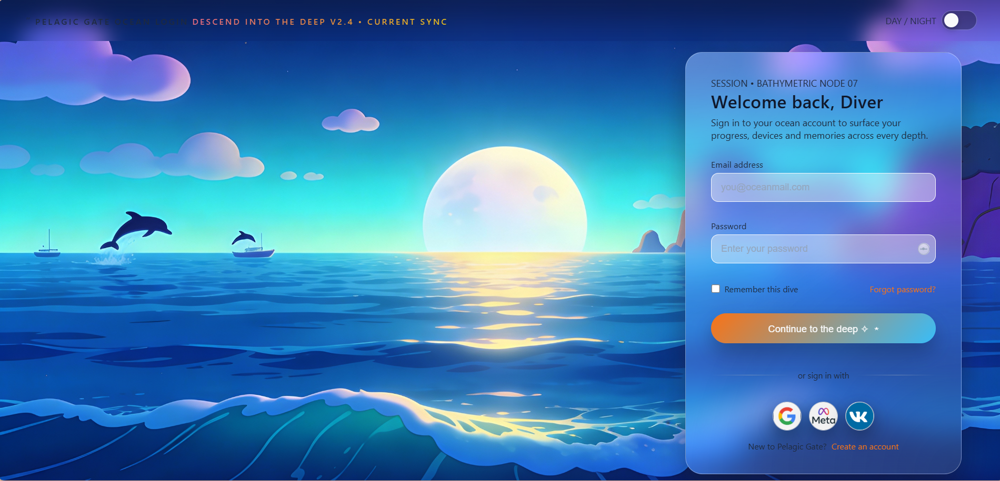
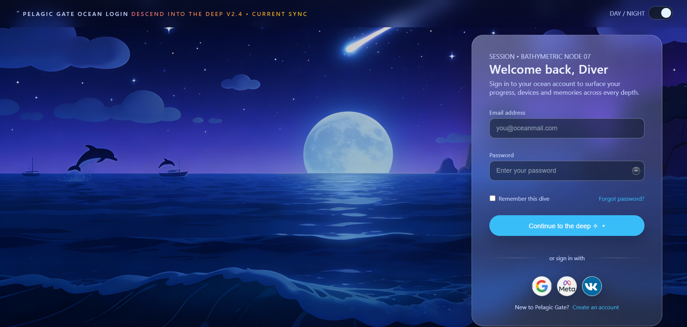

# Ocean Deep Theme - Gallery Preview

## Overview

The **Ocean Deep** theme immerses users in a breathtaking underwater world, combining serene maritime aesthetics with modern glassmorphism to create a tranquil yet engaging login experience. This theme features stunning ocean vistas with marine life, dynamic lighting, and a carefully crafted color palette that evokes the feeling of diving into the depths of the sea.

Both day and night variants maintain the same aquatic landscape composition while presenting distinctly different moods—a bright, sunlit morning ocean and a mystical, moonlit midnight sea. The glassmorphic UI card floats elegantly with subtle transparency effects, soft shadows, and glowing accents that blend seamlessly with the oceanic backdrop.

---

## Light Mode - Sunny Ocean Day

### Preview Image:

### Design Essence
The light mode captures the magic of a tropical ocean morning with vibrant, uplifting energy. The sun shines brilliantly over turquoise waters while dolphins leap playfully in the distance, creating an atmosphere of joy and discovery.

### Color Palette
- **Sky Gradient:** Bright blues transitioning from turquoise to cyan to light purple
- **Ocean Waters:** Multi-layered blues and teals with golden sun reflections
- **Sun/Light:** Bright yellow-white creating warm reflections across the water
- **Card Background:** Semi-transparent light blue-purple glassmorphic panel
- **Primary Button:** Eye-catching orange-to-teal gradient ("Continue to the deep")
- **Input Fields:** Light backgrounds with subtle blue tints
- **Text & Accents:** Clear whites and light blues for optimal readability
- **Marine Life:** Dark silhouettes of dolphins adding depth and narrative

### User Experience
The bright, cheerful palette creates an inviting and adventurous mood. The "Welcome back, Diver" greeting sets an exploratory tone, encouraging users to embark on their digital journey. The vibrant button stands out perfectly against the sky and water, guiding user attention intuitively. The playful dolphins reinforce a sense of wonder and natural beauty.

---

## Dark Mode - Mystical Midnight Ocean

### Preview Image:

### Design Essence
The dark mode transforms the ocean into a mysterious, ethereal realm illuminated by moonlight and starlight. A shooting star streaks across the sky while a luminous full moon casts an ethereal glow over calm, dark waters—perfect for nighttime usage and creating an atmosphere of mystery and contemplation.

### Color Palette
- **Sky Gradient:** Deep navy to midnight blue with purple undertones
- **Ocean Waters:** Dark blues and deep teals with soft moonlight shimmer
- **Moon/Light:** Bright white moon creating atmospheric glow
- **Shooting Star:** Bright streak across the night sky for visual interest
- **Card Background:** Deep blue-purple glassmorphic panel with enhanced transparency
- **Primary Button:** Vibrant cyan that pops against the dark background ("Continue to the deep")
- **Input Fields:** Very dark charcoal backgrounds with light text
- **Text & Accents:** Soft whites and light blues for comfortable nighttime viewing
- **Marine Life:** Silhouettes of dolphins creating depth beneath the moonlit surface

### User Experience
The mystical dark palette creates a calm, meditative atmosphere perfect for evening usage. The bright cyan button provides excellent contrast and naturally draws the eye. The full moon and shooting star add enchanting visual elements that evoke a sense of wonder. The overall design is easy on the eyes during low-light conditions while maintaining clear visual hierarchy.

---

## Shared Design Elements & Features

### Glassmorphic Card
- **Shape:** Smooth rounded corners (border-radius: ~20px) for modern appeal
- **Backdrop Blur:** Frosted glass effect revealing the ocean scene beneath
- **Border:** Subtle glowing edge with soft light reflections
- **Shadow:** Layered shadows creating depth and elevation
- **Transparency:** Carefully balanced to maintain readability while showing background

### Form Elements
- **Input Fields:** Rounded corners with padding, smooth focus states
- **Placeholder Text:** Descriptive guidance ("Email address", "Password")
- **Remember Checkbox:** Thematic label "Remember this dive"
- **Password Field:** Standard security with show/hide toggle

### Interactive Elements
- **Primary Button:** "Continue to the deep" - Clearly action-oriented
- **Secondary Links:** "Forgot password?" and "Create an account"
- **Social Sign-In:** Google, Meta (Facebook), and VK logos
- **Day/Night Toggle:** Located in top-right for theme switching

### Typography & Hierarchy
- **Heading:** "Welcome back, Diver" - Sets the oceanic narrative
- **Subheading:** "SESSION  BATHYMETRIC NODE-07" - Adds sci-fi underwater element
- **Body Text:** Clear, readable fonts with proper contrast
- **Button Text:** Action-oriented language encouraging exploration
- **Footer Text:** Sign-in alternative and account creation options

---

## Design Philosophy

The Ocean Deep theme embodies **aquatic serenity** and **exploratory adventure**. Key design principles include:

- **Dual Atmosphere:** Bright day mode for energetic exploration, dark mode for peaceful contemplation
- **Marine Narrative:** The "Diver" identity and oceanic elements create an immersive story
- **Visual Depth:** Layered landscapes create dimensional perspective (sky  water surface  depths)
- **Glassmorphism Excellence:** The translucent card integrates beautifully with the background
- **Emotional Connection:** Ocean imagery evokes feelings of wonder, peace, and discovery
- **Accessibility:** High contrast ratios in both modes ensure excellent readability
- **Consistency:** Same landscape composition maintains visual continuity between modes

---

## Technical Implementation 💻

- **CSS Variables:** Theme switching leverages custom properties for seamless day/night transitions
- **Responsive Design:** Maintains visual integrity and readability on all device sizes
- **Animation Support:** Smooth transitions for button hovers, focus states, and mode switching
- **Performance:** Optimized blur effects and layer compositing for smooth performance
- **Browser Compatibility:** Tested across modern browsers with graceful fallbacks
- **Accessibility:** WCAG compliant with proper color contrast and keyboard navigation

---

## Files Included 📁

- `ocean-day.png` - Light mode preview (Sunny Ocean Day variant) ☀️
- `ocean-night.png` - Dark mode preview (Mystical Midnight Ocean variant) 🌙
- `README.md` - This comprehensive documentation file 📄

---

## Usage Recommendations 🎯

1. **For Travel & Tourism Apps:** Perfect for booking platforms, diving guides, or vacation planning interfaces 🏖️🤿
2. **For Marine/Science Applications:** Ideal for oceanographic research, marine biology, or aquarium login portals 🐬
3. **For Wellness & Meditation Apps:** The calming ocean aesthetics support relaxation and mindfulness features 🧘
4. **For Adventure Gaming:** Excellent for game login screens with exploration or underwater themes 🎮
5. **For Premium Lifestyle Brands:** Conveys sophistication and luxury through oceanic imagery 💎
6. **For Theme Demonstrations:** Outstanding example of glassmorphism with dynamic dual-mode theming ✨

---

*Ocean Deep Theme - Where every login is an invitation to dive deeper into your digital ocean. 🌊🤿✨*
