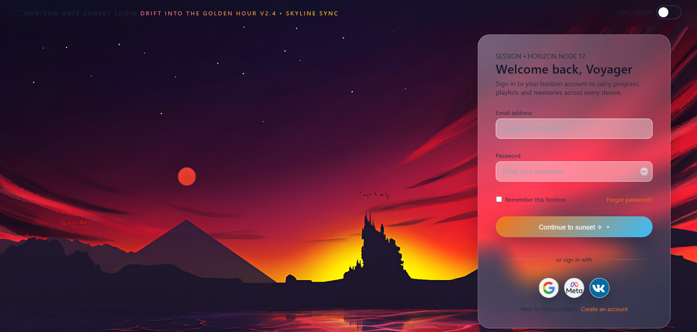
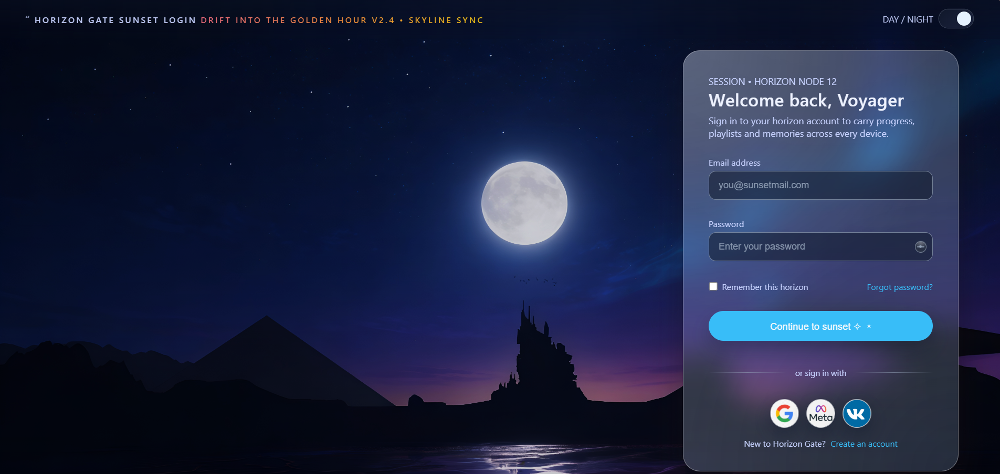

# Sunset Horizon Theme - Gallery Preview

## Overview

The **Sunset Horizon** theme captures a breathtaking transition from day to night over a distant landscape, blending bold atmospheric gradients with modern glassmorphism to create an immersive and cinematic login experience. This theme features a scenic composition with pyramid-like silhouettes on the left and castle-like architecture on the right, all reflected in calm, tranquil waters below.

Both light and dark variants share the same poetic hero illustration backdrop while maintaining distinct color palettes that evoke the energy of sunset and the serenity of moonlit night. The glassmorphic UI card floats elegantly over this landscape with subtle blur effects, soft shadows, and glowing borders that reinforce the futuristic gateway aesthetic.

---

## Light Mode - Golden Sunset

**Preview Image:** 

### Color Palette
The light mode glows with dramatic warm tones that capture the final moments of a vibrant sunset:
- **Sky Gradient:** Deep oranges, reds, and magenta hues
- **Highlights:** Warm golden reflections across the water
- **Primary Button:** Gradient transition from warm orange to cool cyan blue
- **Card Background:** Soft red-pink glassmorphic panel with subtle transparency
- **Input Fields:** Light warm backgrounds with darker text
- **Accent Colors:** Warm coral and peach tones for interactive elements

### User Experience
The warm color scheme creates an energetic, adventurous mood. The prominent "Continue to sunset" call-to-action button stands out with its orange-to-blue gradient, providing strong visual contrast while maintaining harmony with the golden hour aesthetic. Input fields are clearly defined with warmer tones, and the overall composition feels inviting and forward-looking.

---

## Dark Mode - Moonlit Horizon

**Preview Image:** 

### Color Palette
The dark mode shifts to a calm, mystical atmosphere with cool lunar tones:
- **Sky Gradient:** Rich navy and deep purple hues
- **Moon:** Bright full moon illuminating the landscape with cool white light
- **Primary Button:** Vibrant cyan that stands out against the dark sky
- **Card Background:** Deep blue-grey glassmorphic panel with enhanced transparency
- **Input Fields:** Dark charcoal backgrounds with light text for optimal contrast
- **Accent Colors:** Cool blues, purples, and subtle silver accents

### User Experience
The dark mode evokes a quiet, focused atmosphere perfect for nighttime usage. The bright cyan primary button provides excellent contrast against the dark background, while the moon's soft glow adds a sense of calm and sophistication. The overall design is easy on the eyes during evening hours and maintains clear visual hierarchy through strategic color contrast.

---

## Shared UI Design Elements

### Glassmorphic Card
- **Shape:** Rounded rectangle corners (border-radius: ~24px) for modern aesthetics
- **Backdrop Blur:** Subtle frosted glass effect that reveals the landscape beneath
- **Border:** Soft glowing edge that catches light subtly
- **Shadow:** Multi-layered shadows for depth and elevation

### Form Elements
- **Input Fields:** Rounded corners, consistent padding, smooth focus transitions
- **Remember Checkbox:** Styled as "Remember this horizon" - thematic and user-friendly
- **Placeholder Text:** Clear, descriptive guidance in both modes

### Social Sign-In Icons
- **Google, Meta (Facebook), and VK Logos:** Positioned at the bottom for easy access
- **Hover Effects:** Smooth transitions and subtle scale animations
- **Consistent Styling:** Icons maintain brand identity across both modes

### Day/Night Toggle
- **Location:** Top-right corner of the card
- **Function:** Seamless switching between sunset and moonlit variants
- **Visual Feedback:** Clear indicator of current mode

### Typography & Hierarchy
- **Heading:** "Welcome back, Voyager" establishes the theme's narrative
- **Subtext:** Supporting copy maintains readability and thematic consistency
- **Button Text:** Clear, action-oriented language ("Continue to sunset", "Sign in with...")

---

## Design Philosophy

The Sunset Horizon theme is rooted in the concept of **transitional beauty** and **visual continuity**. Whether in the warm golden glow of sunset or the cool serenity of moonlit night, the design maintains:

- **Cohesive Composition:** Same landscape across both modes for visual continuity
- **Atmospheric Storytelling:** Colors tell the story of time passing and worlds transitioning
- **Modern Glass Aesthetics:** Glassmorphism brings elegance without sacrificing functionality
- **Accessibility:** High contrast ratios and clear visual hierarchy in both modes
- **Thematic Narrative:** The "Voyager" welcomes users as if crossing a mystical horizon gate

---

## Technical Implementation

- **CSS Variables:** Both modes utilize CSS custom properties for seamless theme switching
- **Responsive Design:** Maintains visual integrity across all device sizes
- **Animation Support:** Smooth transitions for mode switching and interactive states
- **Performance:** Optimized blur effects and layer compositing for smooth performance
- **Browser Compatibility:** Tested across modern browsers with fallbacks for older versions

---

## Files Included

- `sunset.png` - Light mode preview (Golden Sunset variant)
- `night.png` - Dark mode preview (Moonlit Horizon variant)
- `README.md` - This documentation file

---

## Usage Recommendations

1. **For Creative Industries:** Perfect for design/art portfolio login interfaces
2. **For Evening-Focused Apps:** Excellent for travel, astronomy, or night-mode-heavy applications
3. **For Sophisticated Brands:** Ideal for premium, luxury, or lifestyle product logins
4. **For Theme Showcases:** Great demonstration of glassmorphism and multi-mode design systems

---

*Sunset Horizon Theme - Where every login feels like crossing a gateway between worlds.* ✨
