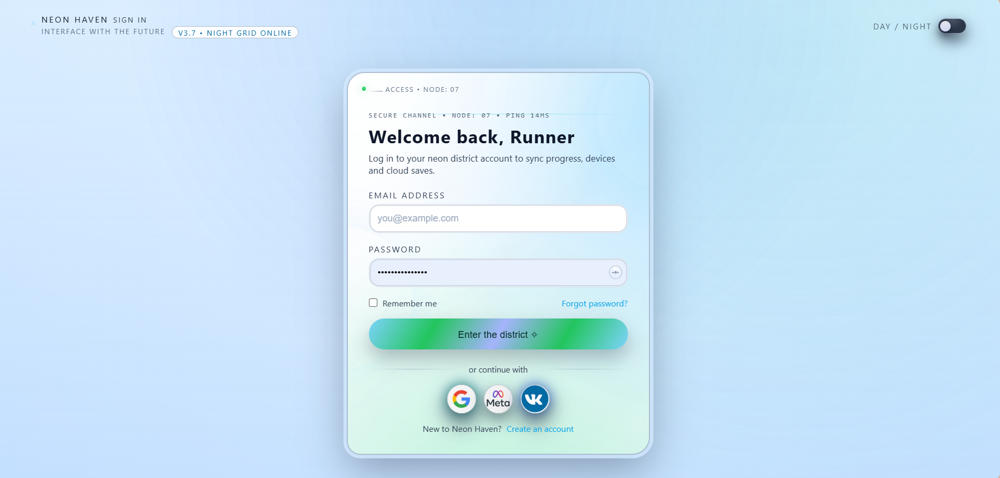
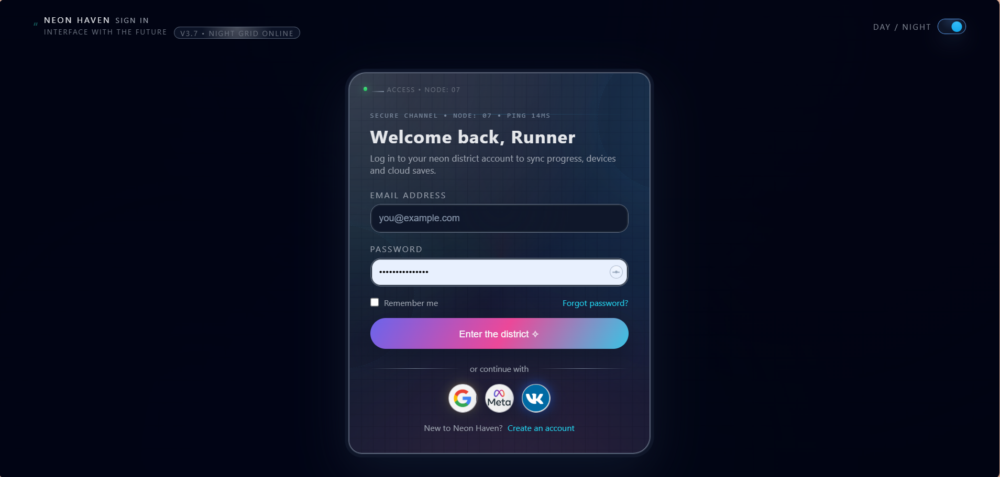

# 🎨 Neon Haven - Urban Neon Theme 1

> A sleek and modern login interface with glassmorphism design featuring dynamic day/night mode switching! ✨

---

## 📋 Overview

Welcome to **Neon Haven Theme 1** - a minimalist yet sophisticated login page design that combines elegance with functionality. This theme showcases a polished glassmorphic login form with a smooth day/night toggle, making it perfect for modern web applications that prioritize user experience.

### 🌟 Key Features

✅ **Glassmorphism Design** - Frosted glass effect with subtle transparency and backdrop blur  
✅ **Day/Night Mode Toggle** - Seamless theme switching in the top-right corner  
✅ **Responsive Layout** - Clean and centered form design  
✅ **Social Auth Integration** - Quick sign-in with Google, Meta, and VK  
✅ **Password Visibility Toggle** - Eye icon to show/hide password field  
✅ **Accessibility Features** - Remember me checkbox and forgot password link  
✅ **Modern Typography** - Branded header and clear information hierarchy  

---

## 📁 Folder Structure

```
theme_1/
├── gallery/                  # Preview images and documentation
│   ├── README.md            # Detailed theme documentation
│   ├── login-light-mode.png # Light mode screenshot
│   └── login-night-mode.png # Dark mode screenshot
├── index.html              # Main HTML file
├── cyber_liquid_glass.css  # Styling with glassmorphism effects
├── bg-urban-day.png        # Background for light mode
├── bg-urban-night.png      # Background for dark mode
├── google_logo.png         # Google authentication icon
├── meta_logo.png           # Meta (Facebook) authentication icon
└── vk_logo.png            # VK authentication icon
```

---

## 🎭 Theme Previews

### ☀️ Light Mode
Warm, clean interface with light blue gradient background



**Features in Light Mode:**
- Soft cyan/blue gradient background
- Clean white form with light border
- Easy on the eyes for daytime browsing
- Perfect for outdoor or bright environments

---

### 🌙 Dark Mode
Moody, sophisticated interface with dark gradient background



**Features in Dark Mode:**
- Deep navy background with subtle gradients
- Glassmorphic effect with enhanced contrast
- Eye-friendly for evening/night usage
- Maintains excellent readability

---

## 🎯 Design Principles

🔹 **Minimalism** - Only essential UI elements, no unnecessary clutter  
🔹 **Contrast** - High readability with proper color contrast  
🔹 **Consistency** - Unified design language across both themes  
🔹 **Usability** - Intuitive interactions and clear call-to-action  
🔹 **Performance** - Lightweight with smooth animations  

---

## 💻 Technical Stack

- **HTML5** - Semantic markup structure
- **CSS3** - Advanced styling with glassmorphism effects
- **JavaScript** - Day/night theme toggle functionality
- **Modern Browsers** - Works on Chrome, Firefox, Safari, Edge

---

## 🚀 Use Cases

✨ SaaS applications  
✨ Admin dashboards  
✨ Modern web apps  
✨ Portfolio websites  
✨ Educational platforms  

---

## 📸 How to View

1. **Preview Screenshots** - Check the `gallery/` folder for before/after screenshots
2. **Open in Browser** - Simply open `index.html` in your browser
3. **Toggle Theme** - Click the day/night toggle in the top-right corner
4. **Responsive** - Resize your browser to test responsiveness

---

## 📝 Notes

This design prioritizes **simplicity and elegance** over flashy decorations. The frosted glass effect combined with the smooth gradient backgrounds creates a premium feel while maintaining excellent readability across different lighting conditions.

The day/night toggle demonstrates JavaScript interactivity and shows understanding of modern UX patterns where users can choose their preferred viewing experience.

**Detailed documentation with preview images available in the `gallery/` folder!**

---

**Theme Status:** ✅ Complete & Ready to Use  
**Last Updated:** December 20, 2025  
**Version:** 1.0
