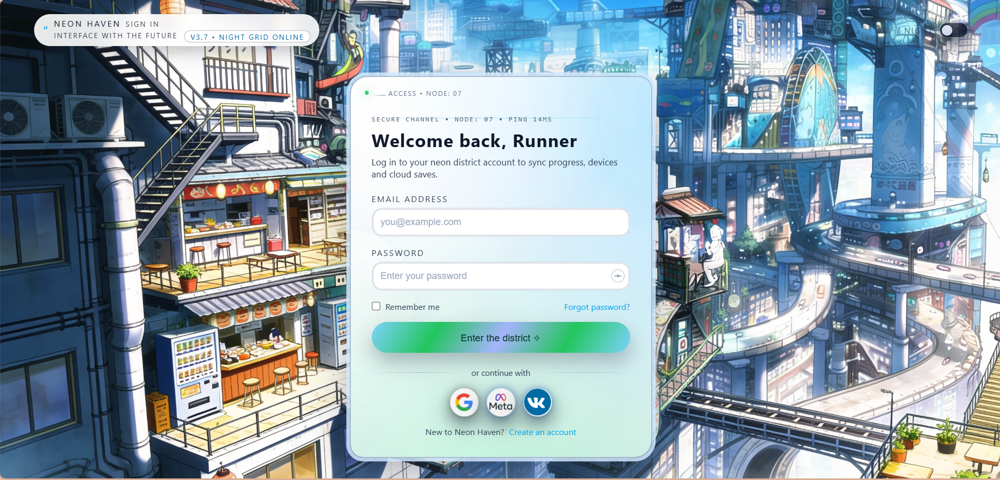
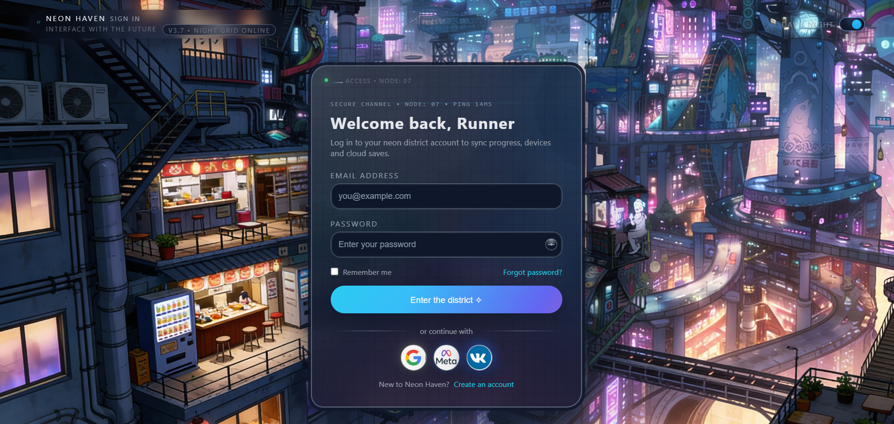

# 🌆 Neon Haven - Theme 2 Gallery

## Visual Previews - Day & Night Modes

Welcome to the Theme 2 gallery showcasing both modes of the Neon Haven login interface. This folder contains preview images of the cyberpunk-inspired liquid glass login design with its stunning day and night variations.

---

## 📸 Theme-2 Day Mode (Light Theme)



### ☀️ Characteristics:

**Visual Style:**
- Bright, clean liquid glass morphism design
- Light blue and white color palette
- Soft, welcoming aesthetic
- Urban cyberpunk cityscape background in daylight
- Gentle gradient shadows and transparency effects

**UI Elements:**
- Light background with semi-transparent glass effect
- Cyan/turquoise accent colors
- Clear text contrast on light backgrounds
- Smooth, rounded corners on form elements
- Glowing effects with cool tones

**Best Used For:**
- Daytime application usage
- Professional/corporate environments
- Users preferring bright, clean interfaces
- High ambient light conditions
- Accessibility-focused designs

**Color Palette:**
- Primary: `#E8F4F8` (Very light cyan)
- Accent: `#00CED1` (Bright turquoise)
- Text: `#333333` (Dark gray)
- Button: `#1DD1A1` (Vibrant green)

---

## 🌙 Theme-2 Night Mode (Dark Theme)



### 🌃 Characteristics:

**Visual Style:**
- Dark, immersive liquid glass morphism design
- Deep purple and neon color palette
- Bold, energetic cyberpunk aesthetic
- Urban neon-lit cityscape background at night
- Vibrant glowing effects and neon accents

**UI Elements:**
- Dark semi-transparent glass background
- Neon purple and cyan glow effects
- High contrast text for readability
- Smooth glass morphism with backdrop blur
- Animated neon light effects

**Best Used For:**
- Nighttime application usage
- Gaming and entertainment platforms
- Users preferring dark mode
- Low light environments
- Modern, trendy applications

**Color Palette:**
- Primary: `#0F1D2D` (Very dark blue-gray)
- Accent: `#FF006E` (Hot magenta/neon pink)
- Secondary: `#00D4FF` (Bright cyan)
- Text: `#E0E0E0` (Light gray)
- Button: `#00D4FF` (Neon cyan)

---

## 🎨 Design Features

### Liquid Glass Morphism
- **Frosted Glass Effect**: Semi-transparent backgrounds with backdrop blur
- **Gradient Overlays**: Subtle color gradients for depth
- **Smooth Transitions**: Fluid animations between states
- **Responsive Design**: Adapts seamlessly to different screen sizes

### Interactive Elements
- **Form Inputs**: Elegant text fields with focus states
- **Buttons**: Dynamic hover and active states
- **Social Login**: Google, Meta, and VK integration buttons
- **Remember Me Checkbox**: Smooth toggle functionality
- **Forgot Password Link**: Quick access to recovery

### Typography
- **Headings**: Bold, modern sans-serif font
- **Body Text**: Clear, readable font stack
- **Labels**: Subtle, descriptive text for form fields

---

## 🔄 Mode Comparison

| Feature | Day Mode | Night Mode |
|---------|----------|------------|
| **Background** | Light Azure | Deep Navy |
| **Primary Color** | Cyan (#00CED1) | Neon Pink (#FF006E) |
| **Secondary Color** | Light Gray | Neon Cyan (#00D4FF) |
| **Text Color** | Dark Gray | Light Gray |
| **Button Color** | Green (#1DD1A1) | Cyan (#00D4FF) |
| **Glow Effect** | Soft | Vibrant |
| **Contrast** | High | Very High |
| **Atmosphere** | Professional | Futuristic |

---

## 💡 Implementation Details

### CSS Features Used
- **Backdrop Filter**: Creates the glass morphism effect
- **Linear Gradients**: Smooth color transitions
- **Box Shadows**: Depth and glowing effects
- **Transitions**: Smooth state changes
- **CSS Variables**: Easy theme customization

### Browser Compatibility
- Chrome/Edge 76+
- Firefox 103+
- Safari 9+
- Mobile browsers (iOS Safari, Chrome Mobile)

---

## 🎯 Use Cases

### Day Mode Ideal For:
✅ Daytime users  
✅ Office environments  
✅ Accessibility compliance  
✅ High brightness settings  
✅ Print-friendly layouts

### Night Mode Ideal For:
✅ Gaming platforms  
✅ Entertainment apps  
✅ Low-light conditions  
✅ Modern/trendy designs  
✅ Eye-comfort in dark environments

---

## 📱 Responsive Behavior

Both modes maintain beautiful aesthetics across:
- **Desktop** (1920px and above)
- **Tablet** (768px - 1024px)
- **Mobile** (320px - 767px)

The liquid glass effect scales gracefully while maintaining visual hierarchy and usability.

---

## 🚀 Theme Integration

To switch between modes, use the theme toggle in the application header or rely on system preferences:
```javascript
// Example: Detect system preference
const prefersDark = window.matchMedia('(prefers-color-scheme: dark)').matches;
const theme = prefersDark ? 'night' : 'day';
```

---

## 📝 Notes

- Both images are optimized PNG files with full-color fidelity
- Screenshots capture the complete login interface
- Animations in the actual implementation add dynamic appeal
- All branding elements (Google, Meta, VK logos) are present
- Responsive design ensures consistency across all devices

---

## 🎓 Learning Points

This theme demonstrates:
- Advanced CSS techniques (backdrop filters, gradients)
- Modern UI/UX design principles
- Dark mode implementation
- Accessibility considerations
- Responsive design patterns
- Animation and interaction design

---

## 📄 Related Files

- `cyber_liquid_glass.css` - Complete styling
- `index.html` - HTML structure
- `bg-urban-day.png` - Day background image
- `bg-urban-night.png` - Night background image
- `README.md` - Main theme documentation

---

**Created with ❤️ for the 60 Login Page Challenge**  
**Theme: Neon Haven - Urban Neon Theme 2 (Cyberpunk Edition)**
